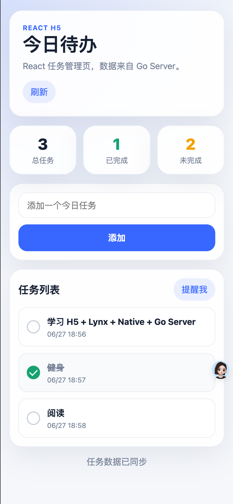

# Daily Todo List App

一个用于入门 **Web/H5 + Lynx + React Native + Native + Go Server** 混合技术栈的 1 天 Demo 项目。

项目主题是「今日待办 APP」：H5 负责完整任务管理页面，Lynx 负责高频可复用的今日任务概览卡片，React Native 负责 Android 侧跨端页面验证，Native iOS / Native Android 负责 App 宿主能力和系统能力接入，Go Server 负责提供简单任务接口与数据存储能力。

## 1. 项目目标

通过一个足够简单、但覆盖完整链路的小项目，快速理解客户端、前端与服务端混合开发中的技术分工：

- **H5 / Web**：使用 React 实现完整业务页面，适合表单、列表、详情、运营活动等变化较快的页面。
- **Lynx**：实现高频、轻量、可复用的动态 UI 组件，例如首页卡片、概览模块、推荐组件等。
- **React Native**：实现 Android 侧跨端页面，用于学习 RN 页面、Android Native Module 和打包安装链路。
- **Native iOS**：实现 iOS App 宿主、Lynx 容器和系统能力，例如 Toast、本地通知、权限等。
- **Native Android**：实现 Android App 宿主、React Native 容器和系统能力，例如 Toast、本地通知、震动、权限等。
- **Go Server**：实现轻量后端接口，提供任务列表、任务创建、任务状态更新等能力。

## 2. Demo 效果

### 2.1 H5 页面图例



### 2.2 功能概览

当前 Demo 项目包含：

1. **H5 任务管理页**
   - 查看今日任务列表
   - 添加新任务
   - 标记任务完成 / 未完成

2. **Lynx 今日任务概览卡片**
   - 展示今日任务总数
   - 展示已完成数量
   - 展示未完成数量
   - 提供「提醒我」或「完成任务」等快捷操作入口

3. **iOS Native 宿主与系统能力**
   - 承载 Lynx 页面 / 卡片
   - 响应 Lynx 事件并触发 iOS Native 能力
   - 支持 Toast / 本地通知 / 震动反馈等能力

4. **React Native Android 页面**
   - 使用 React Native 实现 Android 今日待办页面
   - 复用 Go Server Todo API
   - 通过 Android Native Module 触发 Toast / 本地通知 / 震动反馈

5. **Go Server 后端服务**
   - 提供任务列表查询接口
   - 提供任务创建接口
   - 提供任务完成状态更新接口
   - 提供简单内存存储或本地文件存储

## 3. 技术栈分工

| 模块 | 职责 | 适合学习内容 |
| --- | --- | --- |
| H5 / Web | React 完整任务管理页面 | 组件拆分、Hooks 状态管理、表单、列表渲染、JSBridge 调用 |
| Lynx | 今日任务概览卡片 | 跨端动态组件、卡片化 UI、轻量交互、与 Native 通信 |
| React Native | Android 今日待办页面 | RN 组件、Android 原生模块、Metro、APK 构建与安装 |
| Native iOS | iOS App 宿主与系统能力 | Lynx 容器、Native Module、Toast、本地通知 |
| Native Android | Android App 宿主与系统能力 | RN 容器、Native Module、Toast、本地通知、震动、APK 构建 |
| Go Server | 任务数据接口与本地存储 | REST API、HTTP 服务、JSON 编解码、JSON 文件存储 |

### 3.1 跨端组合规划

| 组合 | 当前状态 | 说明 |
| --- | --- | --- |
| React Lynx + iOS | 已实现 | 使用 ReactLynx / Rspeedy 构建 `main.lynx.bundle`，由 `native-ios` iOS 宿主加载并提供 Native Bridge。 |
| React Native + Android | 已实现 | `react` 负责 React Native JS/TS 页面，`native-android` 负责 Android 原生工程与 Native Module。 |

## 4. 核心功能

### 4.1 H5 支持

- 查看任务列表
- 添加任务
- 标记完成
- 点击「提醒我」调用 Native 能力

### 4.2 Lynx 支持

- 展示今日任务概览
- 展示完成进度
- 提供快捷操作按钮
- 通过事件通知 Native 或 H5 更新状态

### 4.3 iOS Native 支持

- 打开 Lynx 今日任务卡片
- 接收 Lynx 事件
- 弹出 Toast
- 触发本地通知

### 4.4 Go Server 支持

- 查询任务列表
- 创建任务
- 更新任务完成状态
- 返回今日任务统计数据
- 支持跨端通过 HTTP API 访问同一份任务数据

### 4.5 React Native Android 支持

- 打开 Android 今日待办页面
- 查询 / 创建 / 更新 Todo 任务
- 通过 `NativeModules.TodoNative` 调用 Android Toast
- 通过 `NativeModules.TodoNative` 触发本地通知提醒
- 通过 `NativeModules.TodoNative` 触发震动反馈

### 4.6 工程化支持

- H5、Lynx、React Native、Server、Native iOS、Native Android 均提供独立 README
- H5、Lynx、React Native、Server、Native iOS、Native Android 均提供 Makefile 常用命令
- `artifacts/ios/` 用于归档 iOS 安装包
- `artifacts/android/` 用于归档 Android APK / AAB 安装包

## 5. 快速运行

建议按下面顺序启动完整链路：

| 步骤 | 模块 | 命令 | 说明 |
| --- | --- | --- | --- |
| 1 | Server | `cd server && make run` | 启动 Go Todo API 服务，默认端口 `8080` |
| 2 | H5 | `cd h5 && make run` | 启动 React H5 开发服务，默认端口 `5173` |
| 3 | Lynx | `cd lynx && make run` | 启动 ReactLynx / Rspeedy 开发服务，默认端口 `3000` |
| 4 | iOS | `cd native-ios && make bootstrap && make open` | 生成并打开 iOS Lynx 宿主工程，需要 macOS + Xcode |
| 5 | React Native | `cd react && make install && make start` | 安装 RN 依赖并启动 Metro |
| 6 | Android | `cd react && make android` | 使用 `native-android` 原生工程安装到 Android 模拟器 / 真机 |

安装包归档目录：

| 平台 | 目录 | 推荐命名 |
| --- | --- | --- |
| iOS | `artifacts/ios/` | `DailyTodoNative-v0.1.0-adhoc-20260627.ipa` |
| Android | `artifacts/android/` | `DailyTodoNativeAndroid-v0.1.0-debug-20260627.apk` |

## 6. Server 技术栈推荐

为了保证 1 天内能完成 Demo，同时又能学到 Go 后端开发的核心链路，推荐采用「标准库优先、尽量零三方依赖」的方案。

### 6.1 推荐方案

| 能力 | 推荐技术 | 说明 |
| --- | --- | --- |
| 语言 | Go | 简洁、高性能，适合写 API Server |
| HTTP 服务 | 标准库 `net/http` | 不依赖 Web 框架，直接理解 HTTP Handler / Router / Middleware |
| 数据格式 | JSON | H5 / Lynx / Native 都容易接入 |
| 存储 | 本地 JSON 文件 | 零数据库依赖，服务重启后数据不丢失 |
| CORS | 自己用 `net/http` 设置响应头 | 避免引入三方中间件，同时理解跨域响应头原理 |
| ID 生成 | 时间戳 / 简单自增 ID | Demo 阶段不需要复杂 UUID |
| 日志 | 标准库 `log` / `slog` | 先满足调试即可 |
| 配置 | 环境变量 | 例如 `PORT=8080` |

### 6.2 第一天最推荐组合

```text
Go + net/http + JSON 文件存储 + 手写 CORS
```

这个组合适合本项目的原因：

- 学习成本低，不需要先理解复杂框架。
- 零三方依赖，`go run` 即可启动，环境最简单。
- 代码量少，可以把重点放在 API、数据模型和跨端联调上。
- 可以直接理解 Go 标准库中 `http.HandleFunc`、`http.Request`、`http.ResponseWriter` 的用法。
- 很适合实现 Todo 这种小型 CRUD 服务，且能保留本地任务数据。
- 后续可以平滑升级到 SQLite / MySQL / Redis。

### 6.3 暂不推荐第一天引入

- **Gin / Echo / Fiber / chi**：这些框架都很好用，但第一天为了理解底层 HTTP，先不引入。
- **第三方 CORS 中间件**：CORS 逻辑很少，第一版可以直接手写响应头。
- **GORM**：适合真实数据库场景，但第一天会增加模型、连接、迁移等额外复杂度。
- **MySQL / PostgreSQL**：需要安装和配置数据库，容易拖慢入门进度。
- **Redis**：本项目第一版不需要缓存。
- **登录鉴权**：可以作为后续扩展，不建议第一天实现。

### 6.4 推荐演进路线

1. **第 1 阶段**：标准库 `net/http` + JSON 文件存储，实现最小 REST API。
2. **第 2 阶段**：补充存储异常处理、备份恢复、数据迁移等能力。
3. **第 3 阶段**：切换 SQLite，学习数据库表结构和 SQL。
4. **第 4 阶段**：切换 MySQL / PostgreSQL，补充真实后端工程能力。
5. **第 5 阶段**：增加用户登录、JWT 鉴权、多用户任务隔离。

## 7. Server API 设计

第一版使用最简单的 REST API 即可：

| Method | Path | 说明 |
| --- | --- | --- |
| `GET` | `/api/todos` | 获取任务列表 |
| `POST` | `/api/todos` | 创建任务 |
| `PATCH` | `/api/todos/{id}` | 更新任务完成状态 |
| `GET` | `/api/todos/summary` | 获取今日任务统计 |

### 7.1 创建任务请求示例

```json
{
  "title": "学习 H5 + Lynx + Native + Go 混合开发"
}
```

### 7.2 任务列表响应示例

```json
[
  {
    "id": "todo-1",
    "title": "完成今日待办 Demo",
    "completed": false,
    "createdAt": 1782537600000
  }
]
```

## 8. 推荐的一天开发范围

为了保证 1 天内可以完成入门，第一版只做最小可用功能：

### 8.1 必做

- H5：任务列表、添加任务、完成任务
- Lynx：今日任务统计卡片
- Native iOS：加载 Lynx、Toast、本地通知
- React Native：Android 今日待办页面
- Native Android：承载 React Native、Toast、本地通知、震动反馈
- Go Server：任务 CRUD 最小接口、JSON 文件本地存储

### 8.2 可选

- 本地通知
- 数据持久化
- H5 与 Lynx 共享任务数据
- Server 本地文件存储或 SQLite 存储
- 深色模式
- 任务分类 / 优先级

## 9. 数据模型

```ts
type Todo = {
  id: string;
  title: string;
  completed: boolean;
  createdAt: number;
};
```

## 10. 建议目录结构

```text
Daily-todo-list-app/
├── README.md
├── artifacts/          # iOS / Android 安装包归档目录
├── server/             # Go Server，提供任务 API
├── h5/                 # H5 任务管理页面
├── lynx/               # Lynx 今日任务概览卡片
├── native-ios/         # iOS Native Demo App
├── react/              # React Native JS/TS 页面与 Metro 配置
└── native-android/     # Android Native 工程与 RN Native Module
```

## 11. 子模块说明

各子目录有更具体的运行方式、工程命令和调试说明：

| 模块 | 说明 | 文档 |
| --- | --- | --- |
| Server | Go 后端服务，提供 Todo REST API 和本地 JSON 存储 | [server/README.md](server/README.md) |
| H5 | React + TypeScript + Vite + SCSS 实现的 H5 任务管理页面 | [h5/README.md](h5/README.md) |
| Lynx | ReactLynx + Rspeedy 实现的 Lynx 任务页面 / 卡片 | [lynx/README.md](lynx/README.md) |
| Native iOS | iOS Native 宿主工程，加载 Lynx bundle 并提供 Native Bridge | [native-ios/README.md](native-ios/README.md) |
| React Native | React Native JS/TS 业务页面、API 请求和 JS Bridge 封装 | [react/README.md](react/README.md) |
| Native Android | Android 原生宿主工程，承载 React Native 并提供 Native Module | [native-android/README.md](native-android/README.md) |

## 12. 入门价值

这个项目不追求业务复杂度，而是聚焦混合开发的关键链路：

- H5 如何作为完整页面嵌入 Native App
- Lynx 如何作为动态卡片嵌入 Native App
- React Native 如何拆分 JS/TS 业务工程与 Android 原生宿主工程
- Go Server 如何提供跨端统一访问的数据接口
- 前端如何通过 Bridge 调用 Native 能力
- Native 如何响应前端事件并提供系统能力
- 一个简单业务如何拆分到 H5、Lynx、React Native、Native、Server 多层中实现

## 13. 后续可扩展方向

- 接入真实接口或本地数据库
- Server 接入 SQLite / MySQL
- Server 增加用户登录与鉴权
- 增加任务提醒时间
- 增加桌面组件 / 小组件
- 增加任务统计图表
- 将 Lynx 卡片复用到更多页面
- 增加 React Native Android Release 签名、渠道包和 CI 构建
